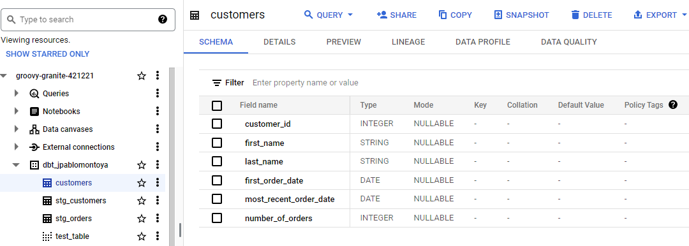
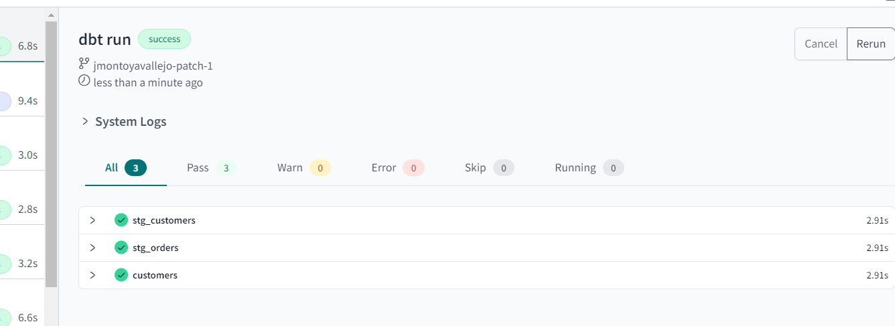
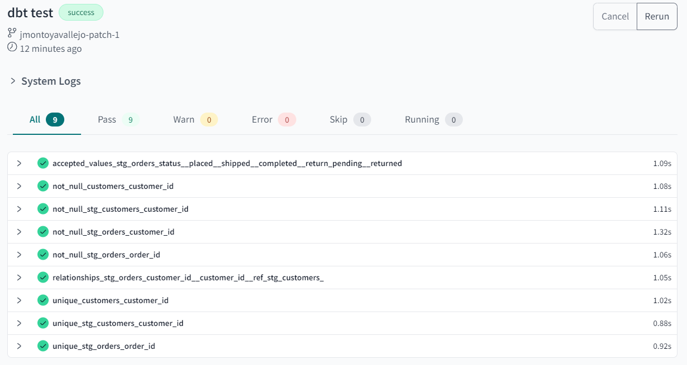
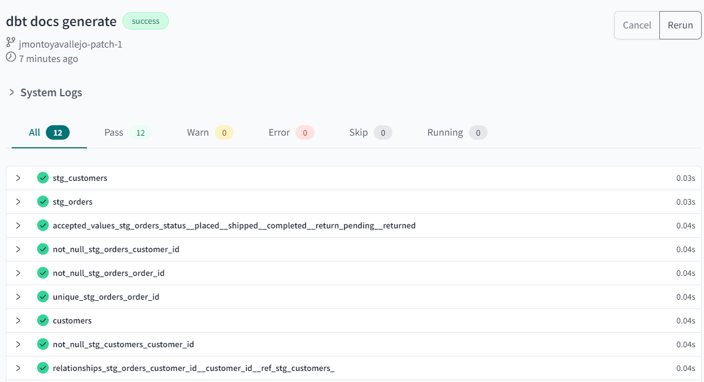
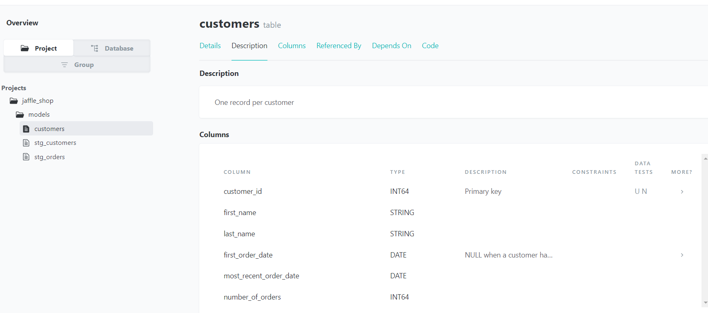

# dbt framework project for python with BigQuery

This repository provides a set of tools and resources to streamline your data transformation workflows using the python framework dbt within a pyenv environment, specifically targeting BigQuery as the database backend.

## Bigquery Datalake

## Installation

To use this repository, follow these steps:

1. Install Pipenv by running the command `pip install pipenv` in the terminal.
2. Clone this repository to your local machine.
3. Navigate to the repository folder in the terminal and run the command `pipenv install -r requirements.txt` to install the necessary dependencies.
4. Activate the virtual environment by running the command `pipenv shell` in the terminal.

## Usage

Once you've installed the project and configured your dbt profile, you can start using the dbt commands to manage your data transformation tasks

### `dbt run`

The `dbt run` command executes all models in the project:

### 2. `dbt test`

The `dbt test` command runs tests on the defined models:

### 3. `dbt docs generate`

The `dbt docs generate` command generates documentation for your project with json format:

### 4. `dbt docs serve`

The `dbt docs serve` command serves the documentation locally for browsing and sharing:

## Contributing

If you would like to contribute to this repository, feel free to fork the project and submit a pull request. We welcome contributions from the community and appreciate any help that we can get.
